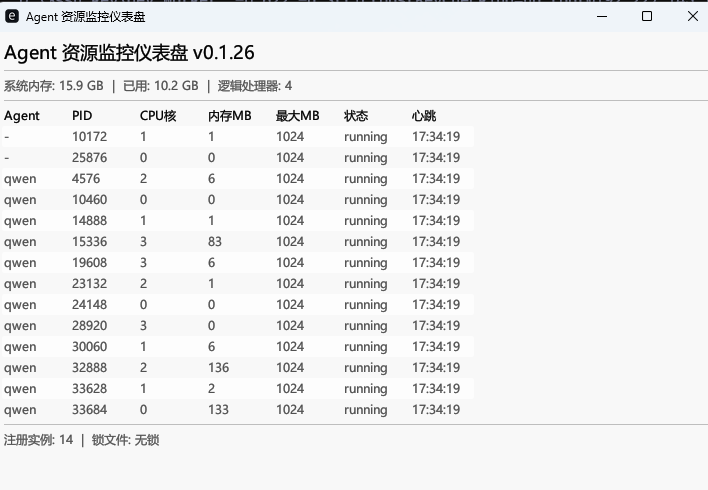

# agent-launcher-safe

> **English version: [README.md](./README.md)**


\n
> **更多文档：[docs/ARCHITECTURE.md](./docs/ARCHITECTURE.md)**

纯RUST编写 — 通用 CLI agent 资源保护启动器 — 为每agent实例强制执行 CPU/内存边界。

## 特性

- **进程发现** — 仅从 `config/config.json` 读取 `qwenPath`。无硬编码路径、无自动搜索。
- **交互式配置向导** — 配置文件不存在或 `qwenPath` 未设置时，`init`/`init-config` 无参数或 `launch` 自动进入 3 步交互式向导（qwen 路径、内存限制、监控间隔）
- **`init` 别名** — `init` 是 `init-config` 的快捷别名
- **CPU 核绑定** — 每个 Qwen 实例获得独占物理 CPU 核，保证性能稳定性
- **共享状态文件** — 实例注册表持久化在 `%TEMP%\qwen-resource-state.json`，与现有 PowerShell `qwen-resource-monitor` 技能兼容
- **后台监控** — 自生成子进程 (`agent-launcher-safe monitor`) 定时检查注册实例内存使用，清理已消失的 PID
- **优雅清理** — Qwen 退出时自动停止监控、注销所有已注册实例
- **工作目录配置** — 配置文件中的 `workingDir` 字段设置 Qwen 子进程工作目录，使 project 级 `.qwen/skills/` 技能可自动加载
- **实时仪表盘** — 启动时显示 PID、CPU 核、内存使用 (MB) 和状态，每 2 秒刷新
- **输入归一化** — 用户输入自动全角→半角转换、去除引号，避免路径校验失败
- **容错状态文件 I/O** — 写入使用临时文件+重命名实现原子操作；读取使用深度计数器容错，自动修复尾部垃圾字符
- **信号处理** — Ctrl+C 时通过原子标志驱动的信号处理器优雅清理资源（停止监控、注销实例）
- **负载均衡核心分配** — 所有 CPU 核占满时，新实例分配到负载最低的核心，而非全部堆积到 core 0
- **配置容错** — 损坏的 `config.json` 输出警告日志后返回默认值，不会 panic 或静默返回零值
- **Linux 兼容** — 状态文件路径支持 Unix 平台（`/tmp/qwen-resource-state.json`），带 `XDG_RUNTIME_DIR` / `TMPDIR` 回退；CPU 绑定使用 `sched_setaffinity`；支持 SIGTERM 信号处理
- **跨进程文件锁** — 共享状态文件的所有读写操作使用 `fs2::FileExt::lock_exclusive()` 排他锁保护，防止并发导致的核心分配冲突和注册丢失
- **僵死实例清理** — 启动时和监控周期中自动清理已崩溃进程（PID 不再存在于进程表中）的残留状态记录
- **孤儿监控防护** — 后台监控子进程追踪父 PID，父进程崩溃时自动退出，避免产生孤儿进程
- **可执行性校验** — `spawn_qwen()` 在启动前验证路径为可执行文件，返回 `InvalidInput` 而非运行时失败
- **超时强制终止** — Qwen 进程 24 小时内不退出的情况下，启动器强制终止而非无限等待
- **进度反馈** — 子进程发现轮询期每 ~0.9s 输出进度日志，避免用户 5 秒静默等待
- **仪表盘 I/O 优化** — 仪表盘每轮刷新只读取一次状态文件，减少约 50% 文件 I/O
- **测试套件** — 46 个单元测试覆盖所有模块：核心分配、进程发现、状态文件 I/O、配置读写、输入归一化、交互式配置向导和僵死实例清理

## CI 流水线

每次推送和 PR 通过 `.github/workflows/ci.yml` 触发 CI 检查：

| 平台 | 检查项 |
|------|--------|
| ubuntu-latest | `cargo check` + `clippy -D warnings` + `cargo fmt --check` + `cargo test` |
| windows-latest | `cargo check` + `clippy -D warnings` + `cargo test` |
| macos-latest | `cargo check` |

## 首次使用

```powershell
# 首次使用：进入交互式向导（提示输入 qwen 路径、内存限制、监控间隔）
agent-launcher-safe init
```

## 安装

```bash
cargo install --git https://github.com/aspnmy/agent-launcher-safe.git
```

或从源码构建：

```bash
git clone https://github.com/aspnmy/agent-launcher-safe.git
cd agent-launcher-safe
cargo build --release
```

## 使用方法

### 启动 Qwen 并带资源保护

```powershell
# 基本启动（后续参数透传给 qwen）
agent-launcher-safe launch -- --model qwen-max

# 或从克隆目录直接运行
.\target\release\agent-launcher-safe.exe launch --
```

### 首次使用（交互式向导）

无配置文件时，`init`、`init-config` 或 `launch` 自动进入配置向导：

```powershell
# 交互式配置（提示输入 qwen 路径、内存限制、监控间隔）
agent-launcher-safe init
```

### 直接配置 qwen 路径

```powershell
# 手动指定 qwen 路径
agent-launcher-safe init-config --qwen-path "C:\Users\nasAdmin\.cherrystudio\bin\qwen.exe"

# 查看当前配置
agent-launcher-safe init-config --show
```

### 自定义资源限制

```powershell
# 设置每个实例内存限制为 2GB
agent-launcher-safe init-config --max-memory-mb 2048

# 设置监控轮询间隔为 30 秒
agent-launcher-safe init-config --monitor-interval 30
```

### 独立运行监控

```powershell
agent-launcher-safe monitor -i 10
```

## 架构

```
src/
├── main.rs       — CLI 入口（clap derive，3 个子命令 + 交互式配置向导）
├── config.rs     — config/config.json 读写（含容错处理）
├── launcher.rs   — 启动编排（基线→启动→注册→信号→等待→清理）
├── monitor.rs    — 后台资源监控循环
├── process.rs    — 进程工具（发现、CPU 亲和性、Qwen 进程正则匹配）
└── state.rs      — 共享状态文件（%TEMP%/tmp qwen-resource-state.json）类型和 I/O
```

## qwen 路径来源

qwen 路径**仅**来自配置文件，无自动搜索、无硬编码路径。

```
① config/config.json → qwenPath 字段（唯一来源）
```

如果配置文件不存在或 `qwenPath` 未设置，`launch` 或 `init` 会自动进入交互式配置向导。

## 配置文件

`<exe 目录>/config/config.json`（便携式 — 与可执行文件同级）

```json
{
  "qwenPath": "C:\\Users\\nasAdmin\\.cherrystudio\\bin\\qwen.exe",
  "maxMemoryMB": 1024,
  "monitorIntervalSec": 10,
  "workingDir": "C:\\$aspnmyTools\\qwen coder"
}
```

- `workingDir`（可选）：Qwen 子进程工作目录。设置后，Qwen 会加载该目录下的 `.qwen/skills/` 中的 project 级技能。

## 状态文件

`%TEMP%\qwen-resource-state.json` — 与现有 PowerShell `qwen-resource-monitor` 技能共享，实现多实例协调。

## 发布

项目使用 GitHub Actions 发布工作流 (`.github/workflows/release.yml`) ，推送 tag 时自动构建 6 个目标平台。

### 触发发布

```bash
# 确保 Cargo.toml 版本号已更新，然后：
git tag v$(grep '^version' Cargo.toml | head -1 | sed -E 's/version[[:space:]]*=[[:space:]]*"([^"]+)".*/\1/')
git push origin v$(grep '^version' Cargo.toml | head -1 | sed -E 's/version[[:space:]]*=[[:space:]]*"([^"]+)".*/\1/')
```

### 构建矩阵

| 系统 | 目标平台 | 打包格式 |
|------|---------|---------|
| ubuntu-latest | x86_64-unknown-linux-gnu | tar.gz |
| ubuntu-latest | x86_64-unknown-linux-musl | tar.gz |
| ubuntu-latest | aarch64-unknown-linux-gnu | tar.gz |
| macos-latest | x86_64-apple-darwin | tar.gz |
| macos-latest | aarch64-apple-darwin | tar.gz |
| windows-latest | x86_64-pc-windows-msvc | zip |

## 许可证

MIT
